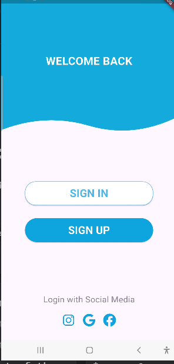
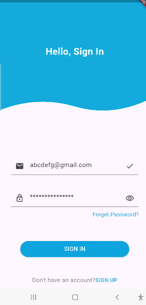
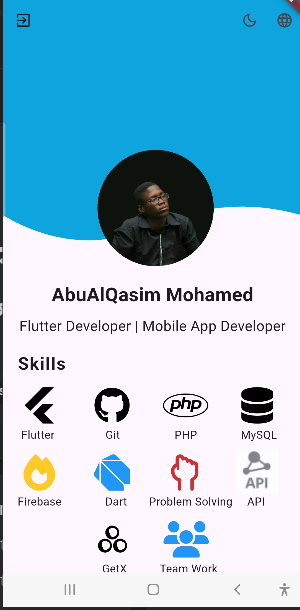
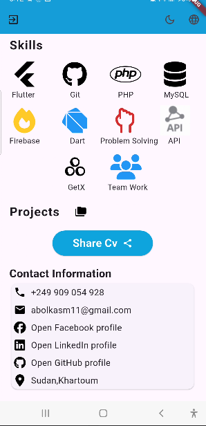
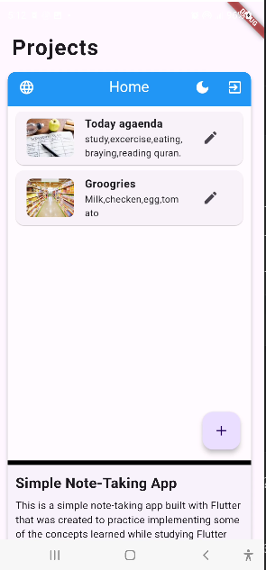
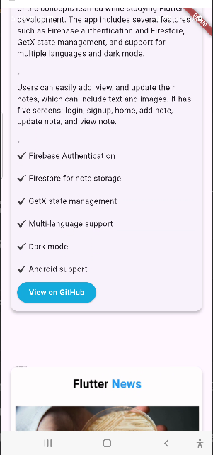
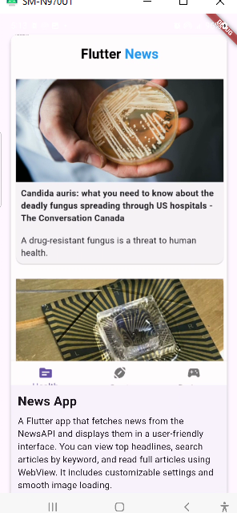
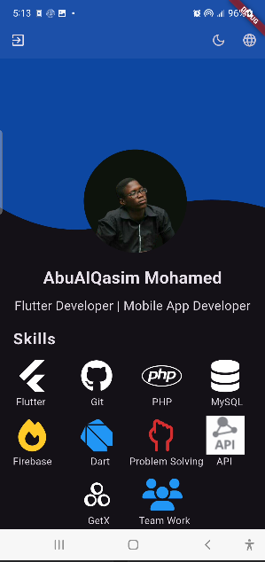

# qasim_flutter_portfolio

A simple Flutter portfolio app to showcase my projects, skills, and experience as a mobile developer.

## 📱 About the Project

This app is designed to present my profile in a clean and professional way using Flutter.  
It includes information about me, my projects, and how to contact me.

## 🚀 Features

- Clean and modern UI
- Responsive design
- Projects section with details
- Contact section
- Language switcher (Arabic / English)
- Dark Mode and Light Mode support
- Sign in with Google
- Sign out feature

## 🛠️ Tech Stack

- **Flutter**
- **Dart**
- **GetX** (State management, routing, dependency injection)
- **Firebase**
- **Git & GitHub**
- **Shared Preferences**

## 📸 Screenshots

### Welcome Page


### Sign In Page


### Developer Info Page


### Developer Info (More Details)


### Projects Page 1


### Projects Page 2


### Projects Page 3


### Dark Theme Mode


## 🔧 Getting Started

To run the app locally:

```bash
git clone https://github.com/QShutta/qasim_flutter_portfolio.git
cd qasim_flutter_portfolio
flutter pub get
flutter run
